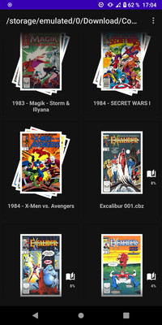
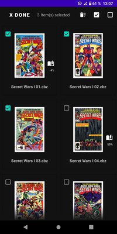
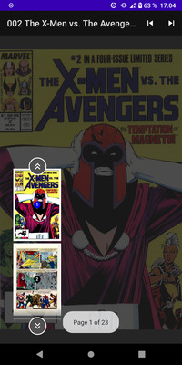
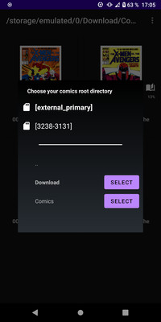
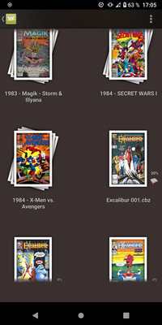
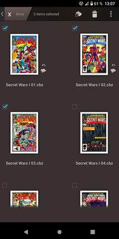
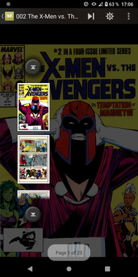
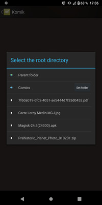

myNewKomik
==========

Présentation (Français)
------------

**myNewKomik** est un petit projet que j'ai créé pour me permettre de mettre en application plusieurs formations que j'ai suivies (principalement sur [Udemy.com][1]).
Il est très largement inspiré d'une ancienne application android qui s'appelait **Komik** qui permettait de lire des comics, ie des archives d'image compressées au format ZIP ou RAR (respectivement avec l'extension CBZ ou CBR). Le but de ce projet est de faire une application en Kotlin reproduisant les mêmes fonctionnalités que **Komik**.

Auteur
------
Frédéric Nourry - [@frednourry][2] sur GitHub

-----------------------------------

#### myNewKomik
   |

#### Komik
   |

-----------------------------------

Presentation (English)
------------

**myNewKomik** is a little project that I created to allow me to apply several training courses that I have followed (mainly on [Udemy.com][1]). It is mainly inspired by an old android application called **Komik** that allowed you to read comicbooks, ie image archives compressed in ZIP or RAR format (respectively with the CBZ or CBR extension). The goal of this project is to make an application in Kotlin, reproducing the same functionalities as **Komik**. 

Author
------
Frederic Nourry - [@frednourry][2] on GitHub

[1]: https://www.udemy.com/
[2]: https://github.com/frednourry
