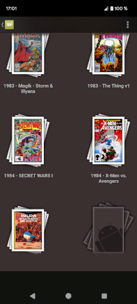
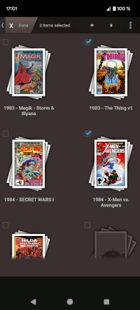
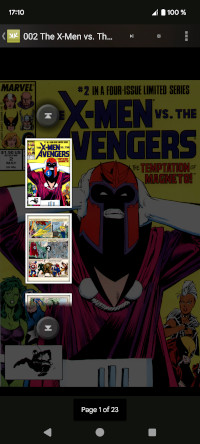
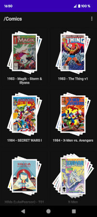

myKomik
==========

Presentation
------------

**myKomik** is a little project that I created to allow me to apply several training courses that I have followed (mainly on [Udemy.com][1]). It is inspired by an old android application called **Komik** that allowed you to read comicbooks, ie image archives compressed in ZIP or RAR format (respectively with the CBZ or CBR extension). The goal of this project is to make an application in Kotlin, reproducing the same functionalities as **Komik**.

I took the liberty of adding new features like a new side-menu, PDF and 7zip support, saving a page locally, and above all, the automatic adjustment of pages according to the user's wishes (centered, enlarged in height or in width).

Author
------
Frederic Nourry - [@frednourry][2] on GitHub

-----------------------------------

Screenshots
------

#### Komik
   

#### myKomik
   

#### myKomik (added features)
  

[1]: https://www.udemy.com/
[2]: https://github.com/frednourry
